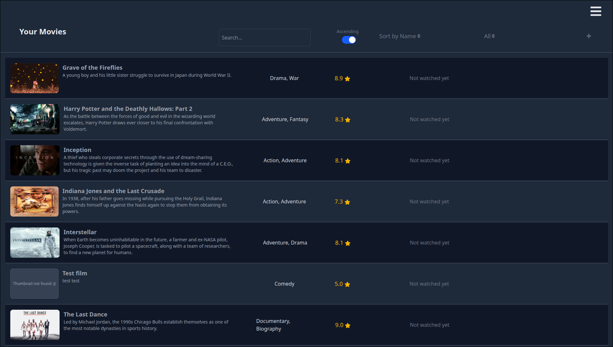
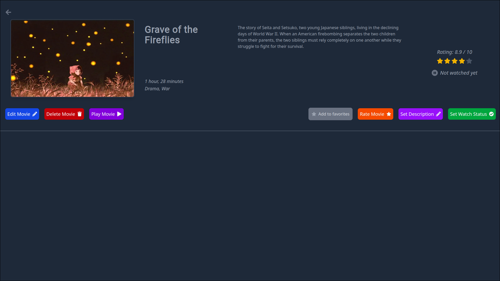
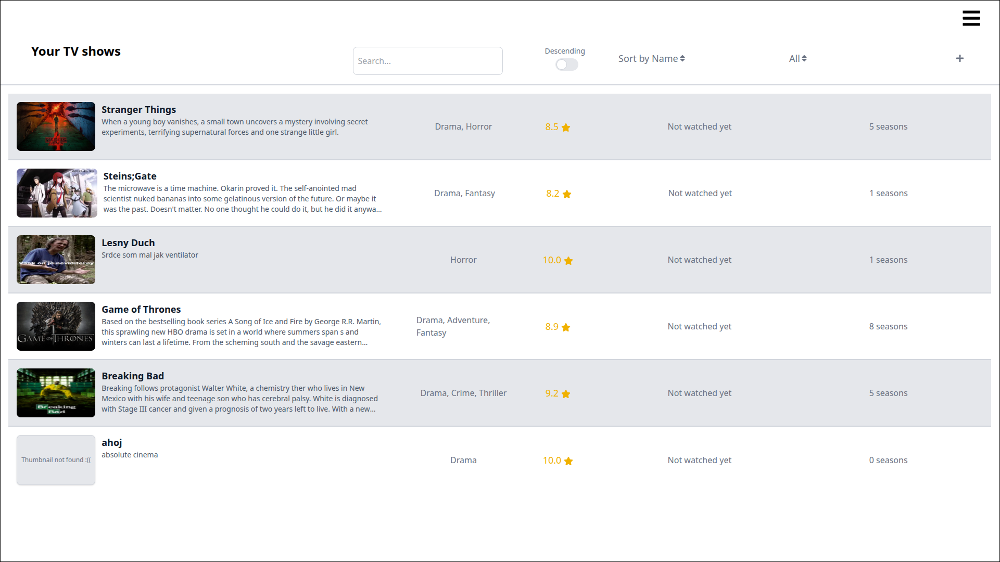
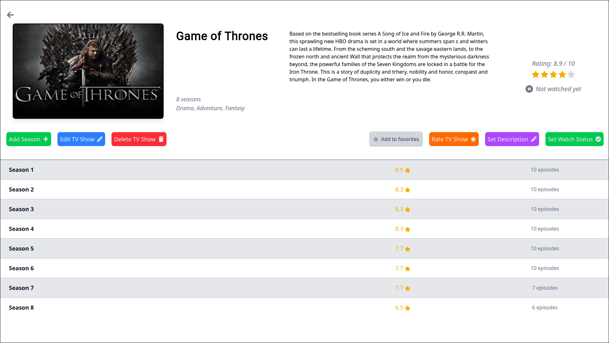
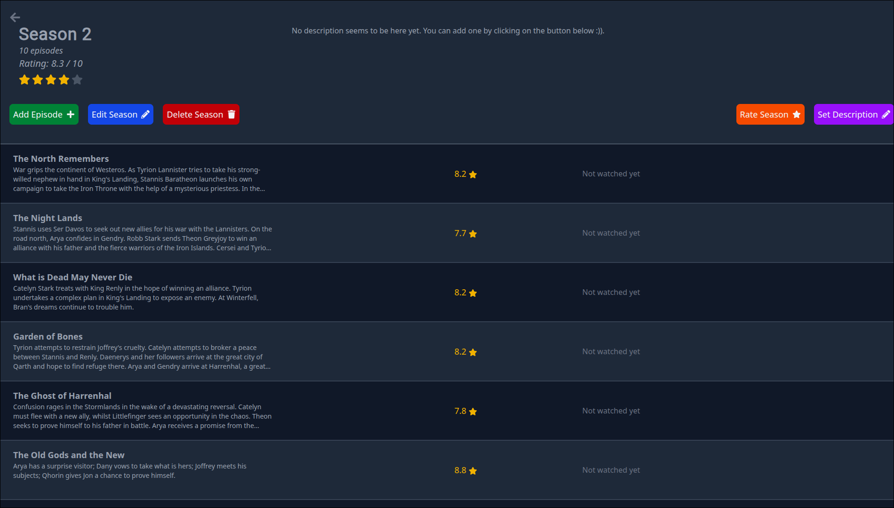
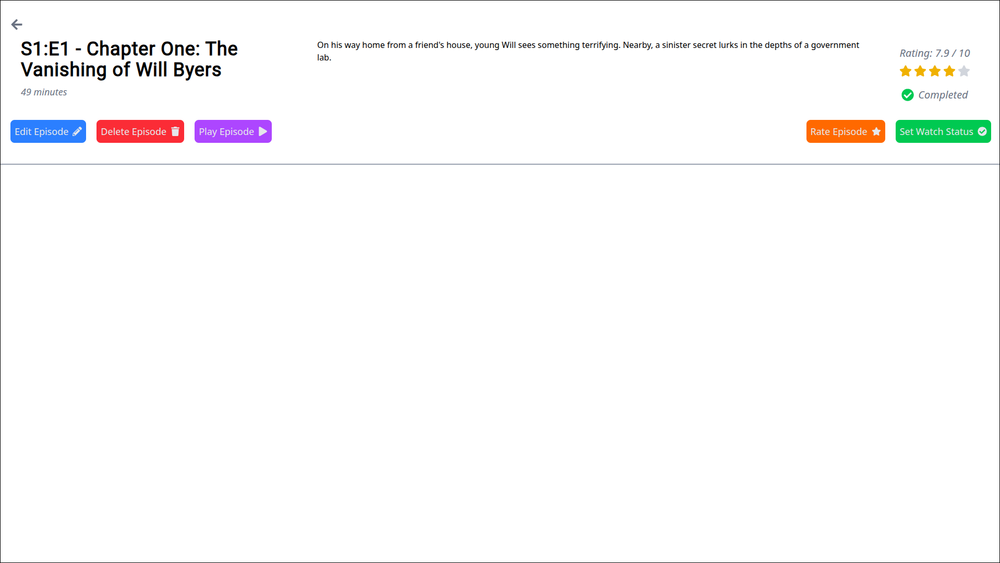
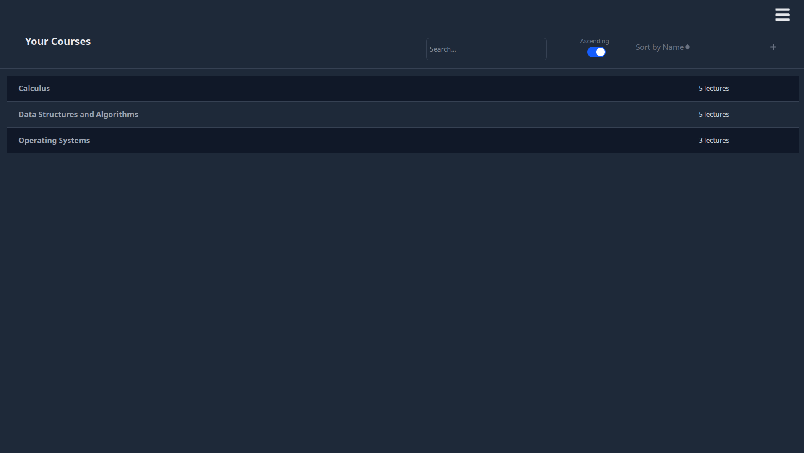
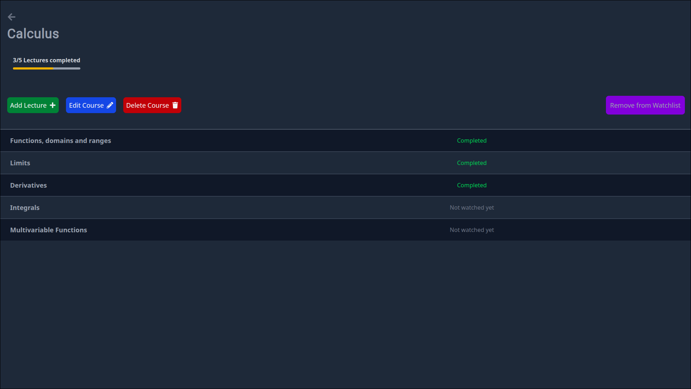
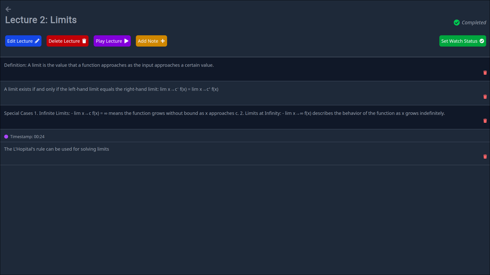
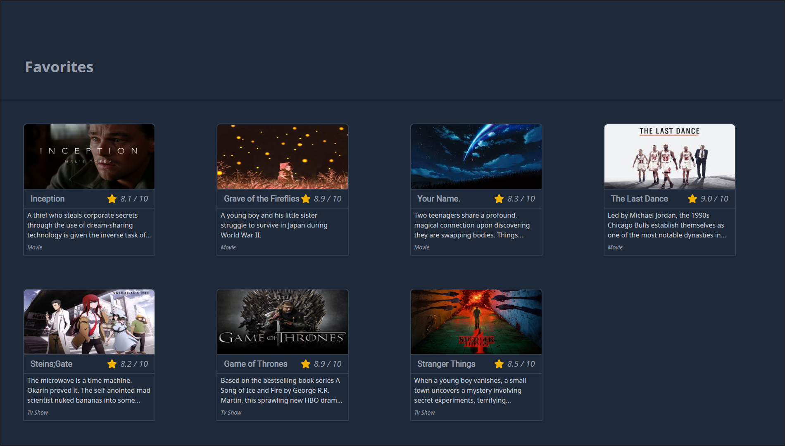

# Media App

## Overview

This is an application for storing a movie, tv show and course library. It allows you to store metadata about these items, including local images and videos and play them. I made this because i watch something all the time (movies and tv shows during the holiday, and lecture replayes during the school year) so i wanted to keep track of it. The app is written in
TypeScript and uses Node for the (self hosted) backend and React (with Tailwind CSS) + Electron for the frontend.

## Table of contents

1. [Requirements and usage](#requirements-and-usage)
   - [Requirements](#requirements)
   - [Usage](#usage)
2. [Features](#features)
   - [Movies](#movies)
   - [TV shows](#tv-shows)
   - [Courses](#courses)
   - [Other](#other)
3. [Notes](#notes)
4. [Screenshots](#screenshots)

## Requirements and usage

### Requirements

To use this app, you need:

1. [NPM and Node.js](https://docs.npmjs.com/downloading-and-installing-node-js-and-npm)
2. [Docker compose](https://docs.docker.com/compose/install/) (if running the app through docker containers) to build the server and client containers.

### Usage

1. Clone this repository: `git clone https://github.com/Igor-Lacko/media-player`.
2. In it's root folder, run either `bash build-docker.sh` (builds docker containers) or `bash build-manual.sh`
3. To run the app, run the generated `media-app.sh` script.
4. To uninstall, run the generated `uninstall.sh` script.

_Note: If running with the docker containers, you may need to set `sudo sysctl -w kernel.apparmor_restrict_unprivileged_userns=0` if you are using Ubuntu 24.04+ (https://github.com/electron/electron/issues/42510#issuecomment-2171583086). You can also run the app with `bash media-app.sh --no-sandbox instead` to disable chrome sandboxing._

## Features

### Movies

The app provides a interface to manage your movie library. Movies can be displayed/sorted/filtered, their metadata edited or added to favorites or to a to-watch list. Movies can be added manually or through the [OMDb API](https://www.omdbapi.com/) (requires a key which can be inputted in settings). You can add video files (or thumbnail images) to movies if you have them stored locally and play them directly in the app.

## Tv Shows

A similiar interface is provided for tv shows. Their seasons/episodes are separate models that can be edited/added. They can also be added manually or from an API, in this case the public [TVMaze API](https://www.tvmaze.com/api) which does not require a key. Video files can be added to individual episodes.

## Courses

Courses and their models are another models that can be added. You can also add notes to lectures, either when displaying their pages or when playing their video file. If you add a note when playing a video file, it has a timestamp associated with it. The video can be set to that specific timestamp when clicked on it in the video player.

## Other

The app displays your movie/tv show watchlists on the home page. It also displays your favorite movies and tv shows and your last watched videos. The app also has dark mode (can be toggled in settings --> Dark Mode). I also plan to add markdown support for taking notes for lectures sometime in the near future.

## Screenshots
This section contains the screenshots of most app pages (other than forms). Alternatively you can view all of these in the *Screenshots/* folder.

### Movies list

### Movie page

### Tv show list

### Tv show page

### Season page

### Episode page

### Course list

### Course page

### Lecture page

### Home page screenshots

![Continue watching]  
