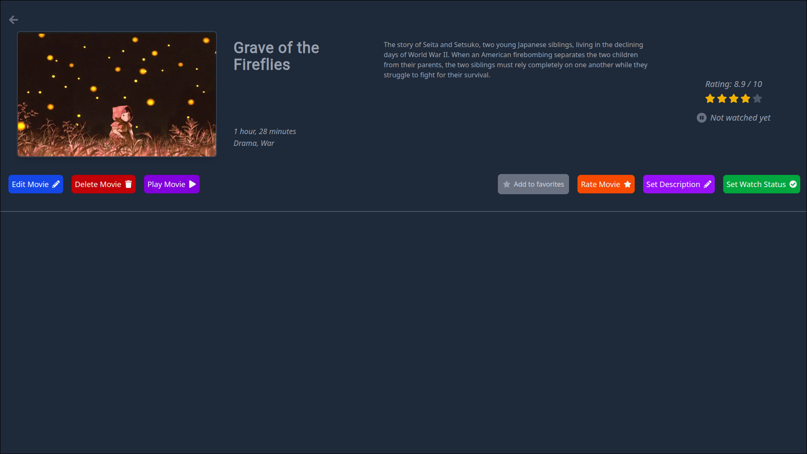
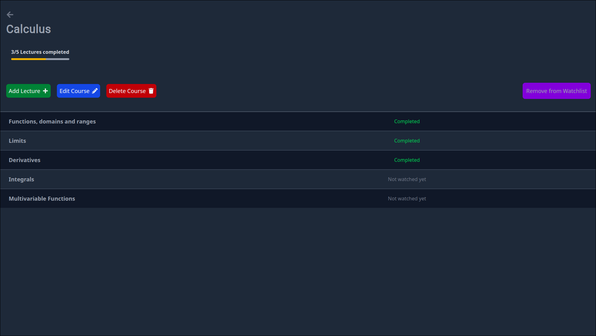

# App images

This README contains some screenshots from inside the app. It covers basically all the pages except forms for creating media and settings.

## Movies list

## Movie page

## Tv show list

## Tv show page

## Season page

## Episode page

## Course list

## Course page

## Lecture page

## Video screenshots

## Home page screenshots

  
  
  
  

